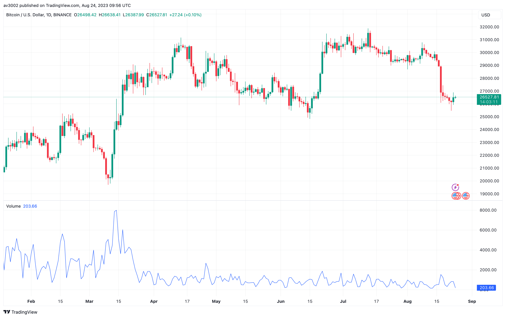
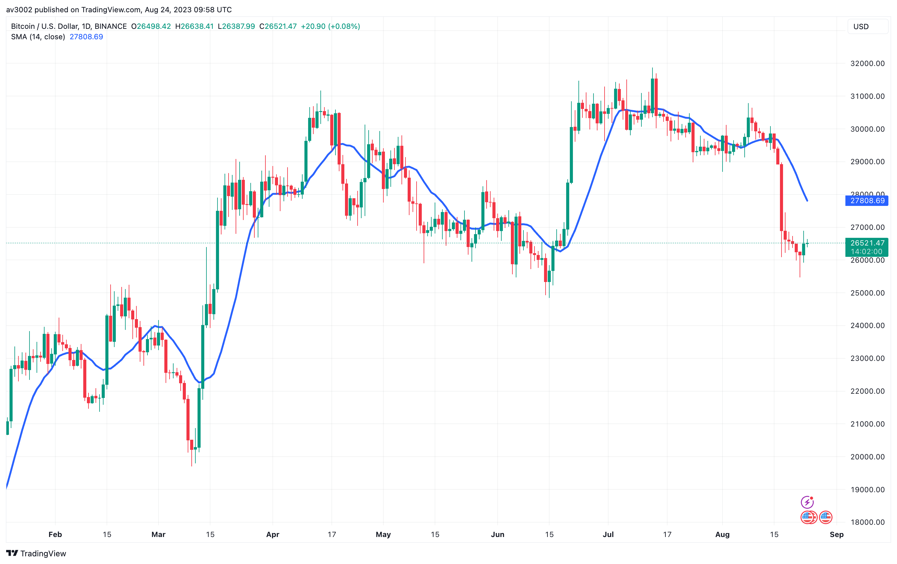
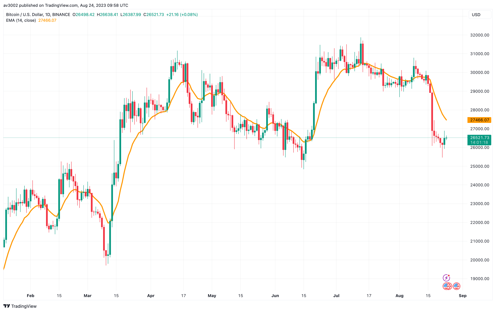
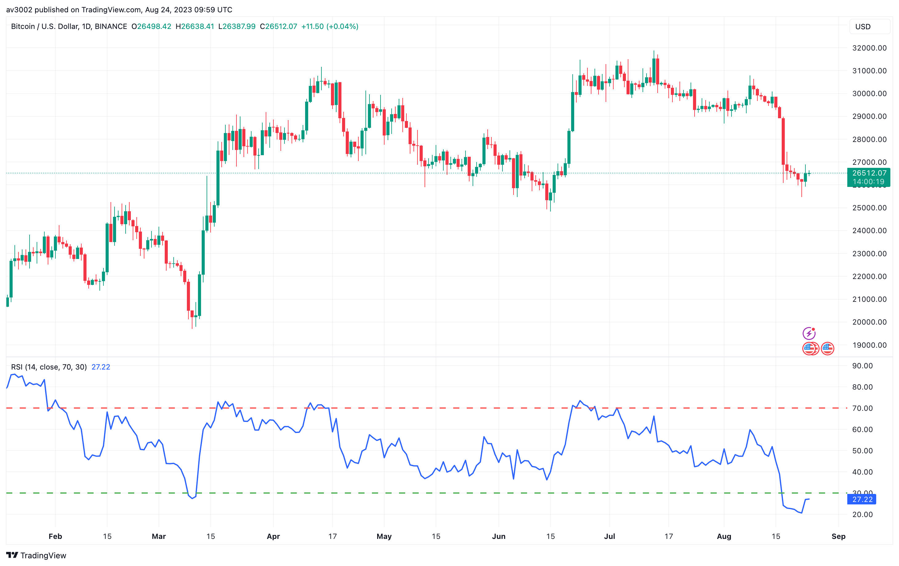
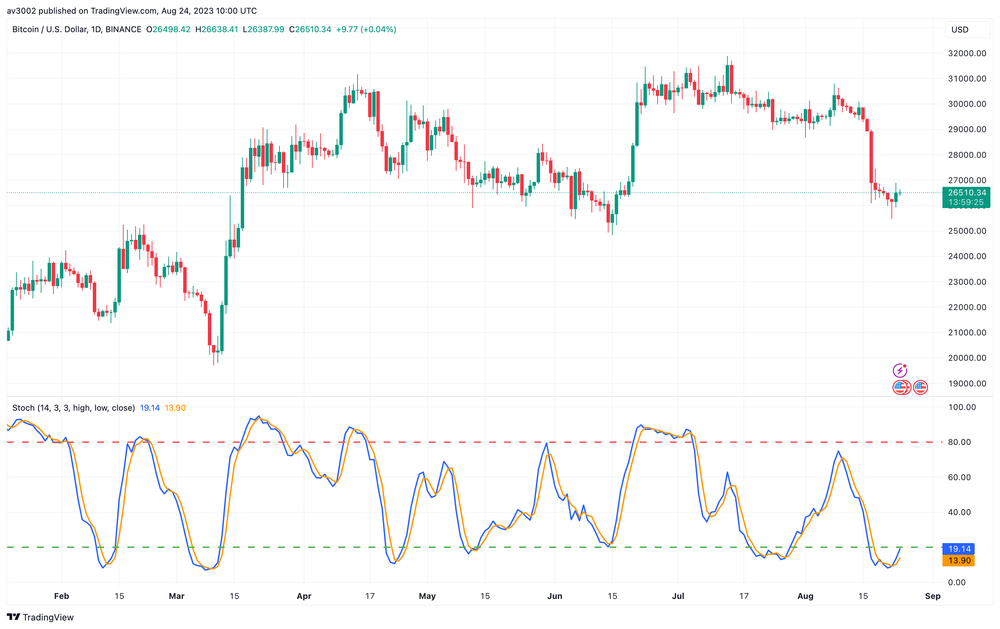

  <h1>📈 Easy-Indicators-Beginner</h1>
  
Welcome to the Easy-Indicators-Beginner repository! This collection of beginner-friendly technical indicators is designed to assist traders and stock market enthusiasts in understanding market trends and making informed decisions. These indicators are coded in Pine Script and are compatible with the TradingView platform.

## 📊 Why Technical Indicators Matter?

Technical indicators play a pivotal role in the stock market and trading by providing valuable insights into price trends, momentum, volatility, and potential reversal points. They help traders analyze historical price data and predict potential future price movements, enhancing their decision-making process.

## 📈 Indicators Included

The following indicators are included in this repository:

- 📊 Trading Volume
- 📈 Simple Moving Averages (SMA)
- 📈 Exponential Moving Average (EMA)
- 📉 Relative Strength Index (RSI)
- 🔄 Stochastic Oscillator

## 📋 Indicator Descriptions

1. **Trading Volume:**
   
   This indicator shows the number of shares or contracts traded over a given period. High volume can indicate increased interest in a security.

2. **Simple Moving Averages (SMA):**
   
   The Simple Moving Average calculates the average price over a specific number of periods.

3. **Exponential Moving Average (EMA):**
   
   Similar to SMA, EMA gives more weight to recent prices, making it more responsive to current market conditions.

4. **Relative Strength Index (RSI):**
   
   RSI measures the speed and change of price movements. Values above 70 may indicate overbought conditions, while values below 30 may indicate oversold conditions.

5. **Stochastic Oscillator:**
   
   The Stochastic Oscillator helps identify potential overbought and oversold conditions with two lines (%K and %D).

## 🚀 Usage and Instructions

To use these indicators:
1. Open the TradingView Pine Script editor.
2. Copy the Pine Script code of the desired indicator from this repository.
3. Paste the code in the Pine Script editor.
4. Customize the indicator's parameters as needed.
5. Apply the indicator to your chart to visualize its signals.

Feel free to explore, modify, and integrate these indicators into your trading strategies. Happy trading!
